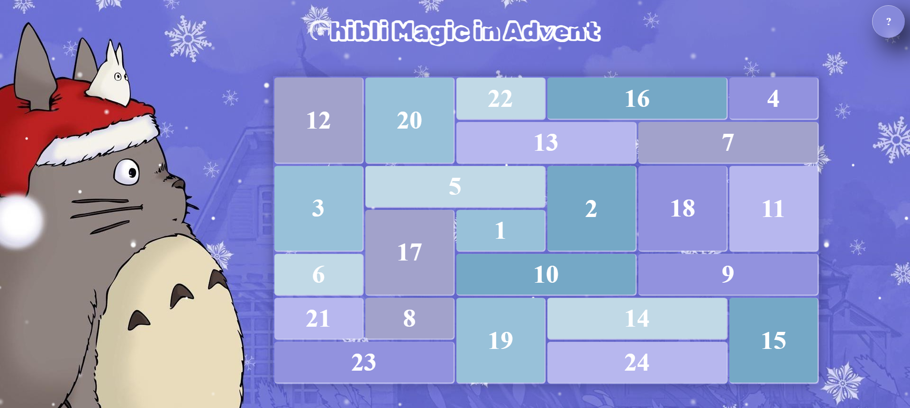
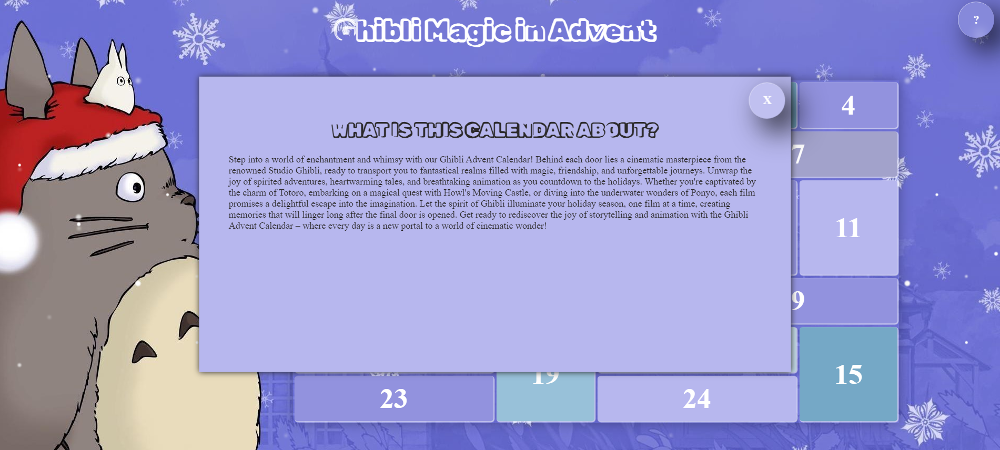
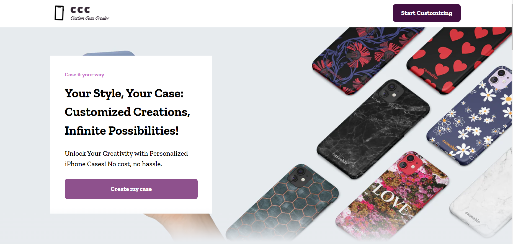
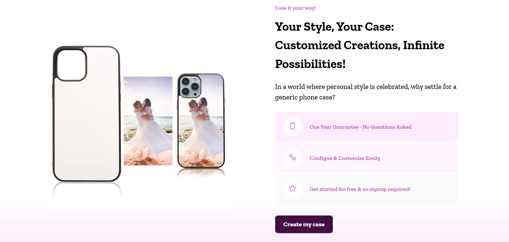
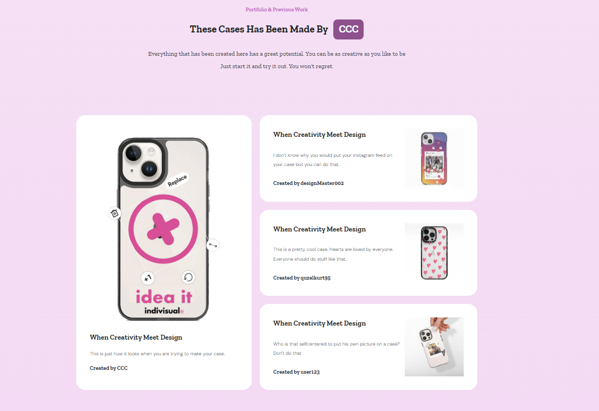
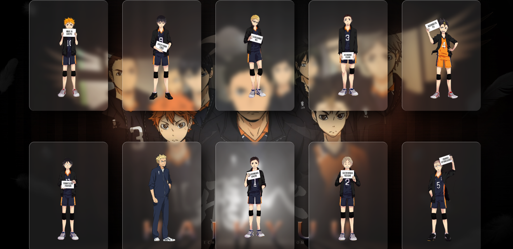
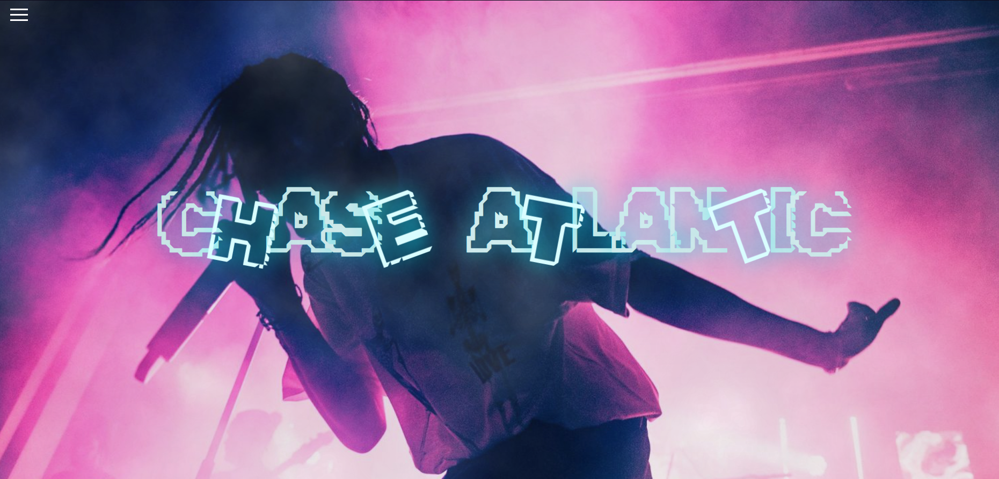
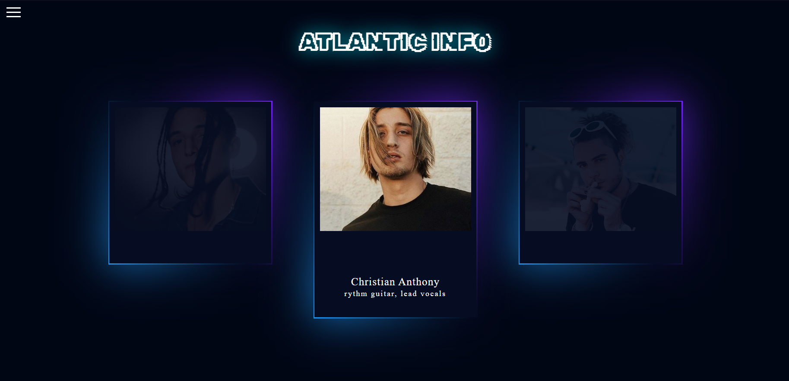

# My-Projects
## 🚀 Explore the Code Nexus, a GitHub repository housing a dazzling array of my finest projects.🌐✨

### [Advent Calendar](AdventCalendar)
In dieser Aufgabe habe ich erstmals gelernt wie ich Bilder im HTML einfügen und positionieren kann. In dem Fall mit Bilder aus der Antarktis
 
  

### [Customizer](Customizer)  [(Link to the Figma Design)](https://www.figma.com/file/1PJMIdKSnPimhTKk7OI17e/CCC_Website-Design?type=design&node-id=1%3A6&mode=design&t=BLo3A14Uhb2WiLAR-1)
In dieser Aufgabe habe ich Animationen in CSS geübt in Form von Fischen in einem becken die sich hin und her bewegen
 
 
 
 

### [Theme Site](Themenseite)
In dieser Aufgabe habe ich mit flexbox versucht die platzierung der einzelnen Elemente zu üben, was mir jetzt nicht gerade gut gelungen ist :)
  

### [Webpage about Artist](Webpage_ChaseAtlantic)
In dieser Aufgabe habe ich die verschiedensten preloader mithilfe von Animationen ausprobiert
  
  
 

