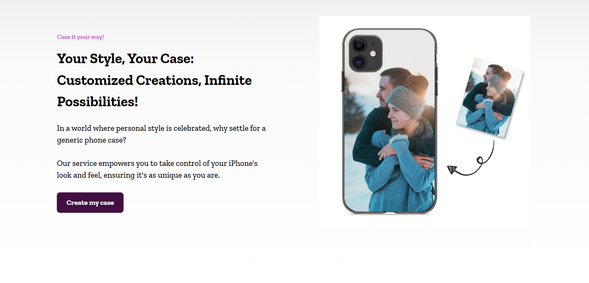

# My Projects explained
## 🚀 Explore the Code Nexus, a GitHub repository housing a dazzling array of my finest projects.🌐✨

## [Advent Calendar](AdventCalendar) 
Due to the holiday season, I've decided to create a small Ghibli advent calendar using PHP.

 
  

---

## [Customizer](Customizer)  [(Link to the Figma Design)](https://www.figma.com/file/1PJMIdKSnPimhTKk7OI17e/CCC_Website-Design?type=design&node-id=1%3A6&mode=design&t=BLo3A14Uhb2WiLAR-1)
A little website where you can customize your own phone case 
 
 
 
 

---

## [Theme Site](Themenseite)
Tried out some card design with Haikyuu characters. 
  

---

## [Webpage about Artist](Webpage_ChaseAtlantic)
Experimented with a creatively designed website for a unique and unconventional look that sets it apart from the usual, casual websites.
  
  
 

